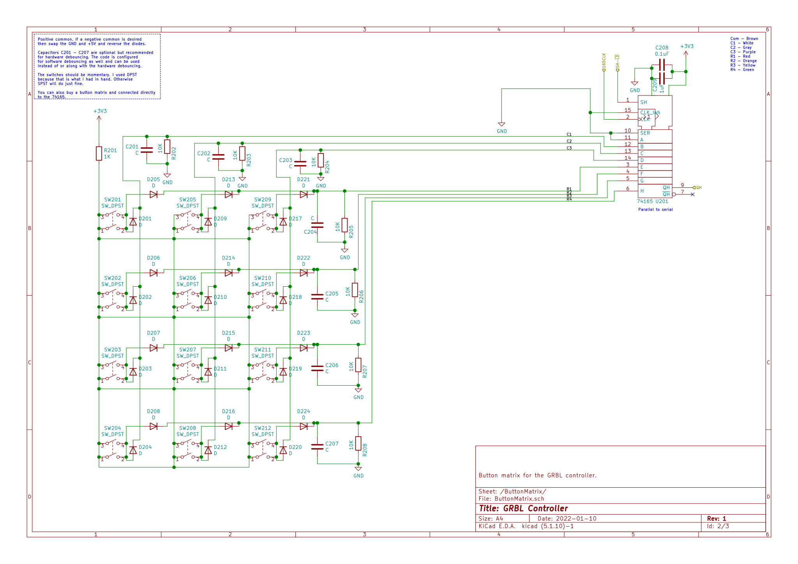

# GrblJogCtrlSchematic
Schematic for the embedded GRBL jog controller.  

This is in the form of a KiCAD project.  

The microcontroller board used (Teensy 4.1): https://www.pjrc.com/store/teensy41.html  

The Display breakout board called out in the schematic can be ordered from OshPark: https://oshpark.com/shared_projects/djFs49lT  
The TFT LCD I used is from BuyDisplay.com: https://www.buydisplay.com/serial-spi-3-5-inch-tft-lcd-module-in-320x480-optl-touchscreen-ili9488  

I have no affiliation with BuyDislay.com or PJRC.  

Write up about the device with pictures and links to demo videos: https://discuss.inventables.com/t/grbl-hand-held-controller-with-jog-wheel-dro-and-built-in-sender/109009  

Source code for the Teensy 4.1: https://github.com/quezadaminter/GrblJogCtrl  

# Page 1/2
  

# Page 2/2

# Parts Used
1- Teensy 4.1 Development Board.  
1- ILI9488 LCD https://www.buydisplay.com/serial-spi-3-5-inch-tft-lcd-module-in-320x480-optl-touchscreen-ili9488  
1- 50 pin LCD breakout adapter board. Link in the schematic.
1- 12 Button key pad, I made my own but there are many options out there.  
1- Shift register IC to read keypad.  
2- 12 position rotary selector switches (12PST).  
1- Female USB 2.0 type A connector.  
1- 20 pulse rotary encoder with momentary switch. Feel free to substitute for one with a higher resolution.  
